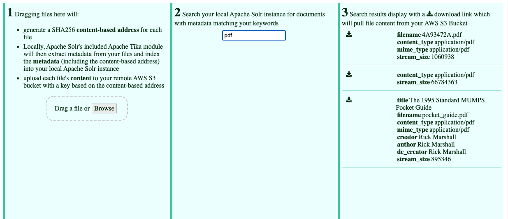

# aws-bucketeer

Learning AWS Buckets with [Weepy](https://github.com/chrisbratlien/weepy)

Building a multi-container app to:

- Index binary file (PDF, MP3, etc.) metadata, including a content-based SHA256 address, using a self-hosted Apache Solr container (with Tika and Solr Cell plugins) for indexing and search (but **not** file content storage)
- For storage, upload each indexed file to an Amazon S3 bucket with the SHA256 content address as part of its bucket key.
- Search results will include the SHA256 content address, enabling retrieval of the file content of any search result from the S3 bucket.



## References

AWS S3 PHP example  
https://docs.aws.amazon.com/AmazonS3/latest/userguide/UsingTheMPphpAPI.html
https://aws.amazon.com/sdk-for-php/

Composer  
https://getcomposer.org/download/

Installing AWS SDK using Composer:

```
composer require aws/aws-sdk-php
```

Ideally use Composer. However, I used the SDK .zip for now due to my Composer being sick.

https://docs.aws.amazon.com/sdk-for-php/v3/developer-guide/getting-started_installation.html

https://docs.aws.amazon.com/sdk-for-php/v3/developer-guide/guide_configuration.html

### Solr

We want Apache Tika and Apache Solr Cell enabled for extracting metadata from binary files, so in the solrconfig.xml, we'll add:

```xml
  <lib dir="${solr.install.dir:../../..}/contrib/extraction/lib" regex=".*\.jar" />
  <lib dir="${solr.install.dir:../../..}/dist/" regex="solr-cell-\d.*\.jar" />
```

and:

```xml
<requestHandler name="/update/extract"
                startup="lazy"
                class="solr.extraction.ExtractingRequestHandler" >
  <lst name="defaults">
    <str name="lowernames">true</str>
    <str name="fmap.content">_text_</str>
  </lst>
</requestHandler>
```

following the documentation at https://solr.apache.org/guide/8_5/uploading-data-with-solr-cell-using-apache-tika.html

### CURLOPT

`CURLOPT_RETURNTRANSFER` set to `true` to return the transfer as a string of the return value of curl_exec() instead of outputting it directly.

https://www.php.net/manual/en/function.curl-setopt.php

### php.ini

Set these to something big enough to fit your upload needs.

```ini
upload_max_filesize = 128M
post_max_size = 128M
memory_limit = 512M
```

### Emoji

https://www.w3schools.com/charsets/ref_emoji.asp
